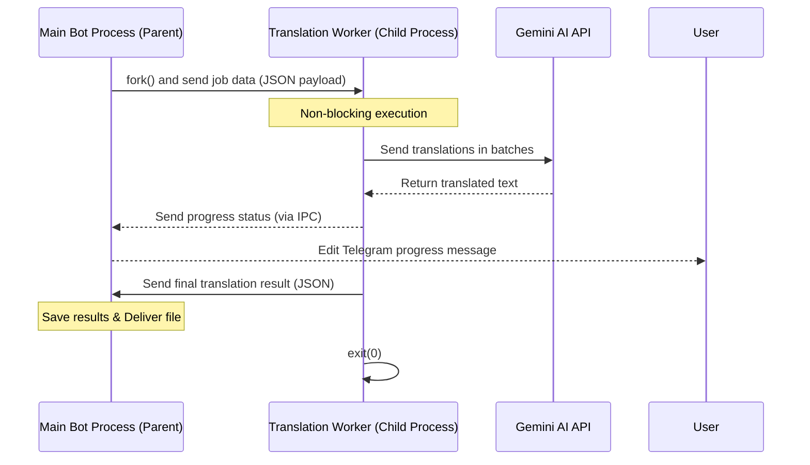

# CPU-Intensive Task Isolation: Child Process Forking

In Node.js, CPU-intensive tasks—such as parsing massive subtitle files, splitting text, regex-based token matching, and parsing large JSON objects—block the single-threaded **Event Loop**. When this happens, the Telegram Bot stops responding to user interactions, commands hang, and web health checks may fail (triggering unnecessary restarts on Render.com).

This guide shows how to isolate the `SubTrans AI` translation module into a separate child process using Node's `child_process.fork()` API.

---

## 1. How It Works (Process Architecture)



---

## 2. Implementation Blueprints

### A. The Worker Process Script (`src/workers/translationFork.js`)
This script executes independently of the main thread. It imports the translation service and listens for messages via the built-in IPC (Inter-Process Communication) channel.

```javascript
import { translateSubtitles } from '../../service.js';

// Listen for messages from the parent process
process.on('message', async (message) => {
  const { type, payload } = message;

  if (type === 'START_TRANSLATION') {
    try {
      const {
        content,
        ext,
        targetLanguage,
        qualityPrompt,
        systemPrompt,
        batchSize,
        projectTitle,
        episodeNumber
      } = payload;

      const result = await translateSubtitles({
        content,
        ext,
        targetLanguage,
        qualityPrompt,
        systemPrompt,
        batchSize,
        projectTitle,
        episodeNumber,
        // Notify parent about progress updates
        onProgress: async ({ total, translated, eta, progressBar }) => {
          process.send({
            type: 'PROGRESS',
            data: { total, translated, eta, progressBar }
          });
        }
      });

      // Send the final result back to the parent
      process.send({
        type: 'SUCCESS',
        data: result
      });
      
      // Clean up child process
      process.exit(0);

    } catch (error) {
      // Send error details back to the parent
      process.send({
        type: 'ERROR',
        error: error.message
      });
      process.exit(1);
    }
  }
});
```

---

### B. Spawning and Managing the Child Process (`bot.js`)
Replace the direct call to `translateSubtitles` with a wrapper that forks the child process and handles messaging.

```javascript
import { fork } from 'child_process';
import path from 'path';

/**
 * Runs the subtitle translation inside an isolated Node.js child process.
 * Keeps the main bot process 100% responsive.
 */
function runTranslationInChildProcess(options) {
  return new Promise((resolve, reject) => {
    // Path to the child process worker script
    const workerPath = path.resolve(process.cwd(), 'src/workers/translationFork.js');
    
    // Spawn the child node process with IPC enabled
    const child = fork(workerPath, [], {
      env: { 
        ...process.env,
        NODE_ENV: 'production' 
      },
      stdio: 'inherit' // Automatically forwards console logs to the parent terminal
    });

    // Handle incoming messages from the worker
    child.on('message', (message) => {
      const { type, data, error } = message;

      switch (type) {
        case 'PROGRESS':
          if (options.onProgress) {
            options.onProgress(data);
          }
          break;
        case 'SUCCESS':
          resolve(data);
          break;
        case 'ERROR':
          reject(new Error(error));
          break;
      }
    });

    // Handle unexpected worker exits (crashes, system kills, out of memory)
    child.on('exit', (code) => {
      if (code !== 0) {
        reject(new Error(`Translation worker exited unexpectedly with code ${code}`));
      }
    });

    // Handle process errors
    child.on('error', (err) => {
      reject(err);
    });

    // Start translation by sending the payload
    child.send({
      type: 'START_TRANSLATION',
      payload: {
        content: options.content,
        ext: options.ext,
        targetLanguage: options.targetLanguage,
        qualityPrompt: options.qualityPrompt,
        systemPrompt: options.systemPrompt,
        batchSize: options.batchSize,
        projectTitle: options.projectTitle,
        episodeNumber: options.episodeNumber
      }
    });
  });
}
```

---

### C. Integrating with the Telegram Action
In `bot.js` inside `runTranslation`, change:

```diff
-const response = await translateSubtitles({
+const response = await runTranslationInChildProcess({
   content: session.fileContent,
   ext: session.fileExt,
   targetLanguage: session.targetLanguage,
   // ...
```

---

## 3. Advantages of This Isolation

1. **Non-blocking Event Loop**: The main thread handling Telegram updates never lags. Ping endpoints (`/health`) return instantly, avoiding Render system timeouts.
2. **Crash Resilience**: If a particular subtitle file causes a parser crash or hits an memory exception inside the AI library, only the child process dies. The main bot server remains online.
3. **Dedicated Resource Allotment**: Operating systems schedule isolated child processes on separate CPU cores automatically, meaning translation speeds can increase in multi-core VPS systems.
